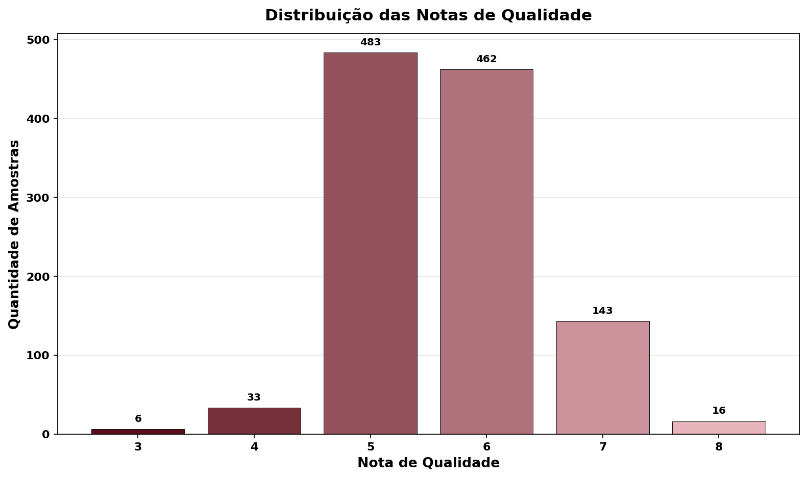
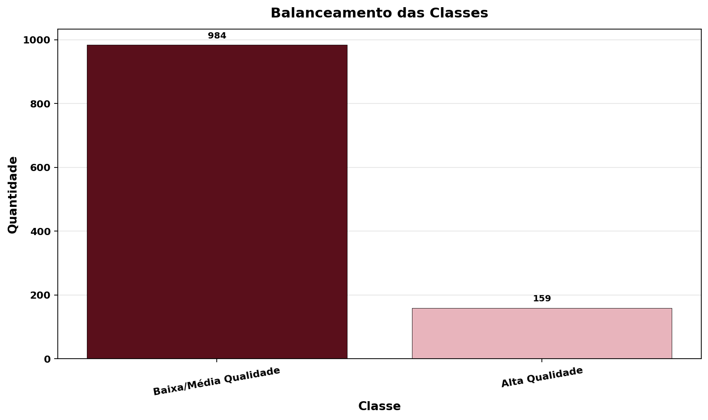
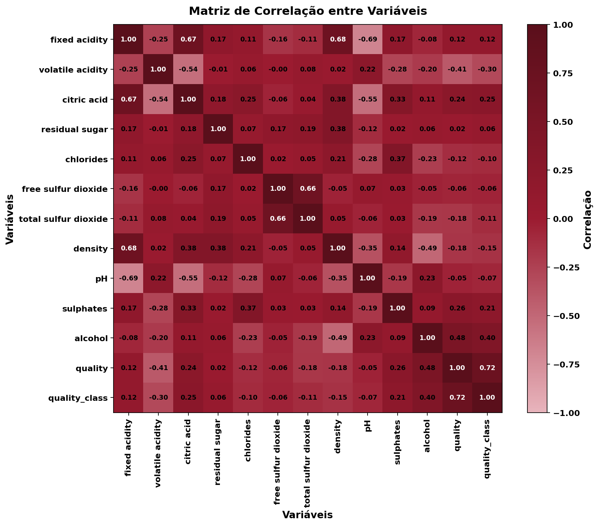
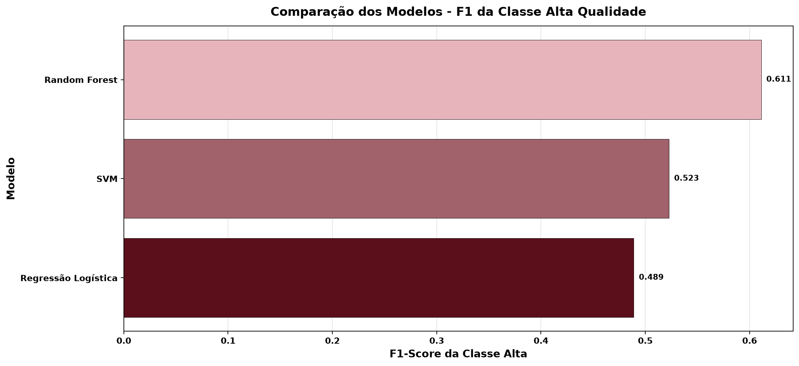
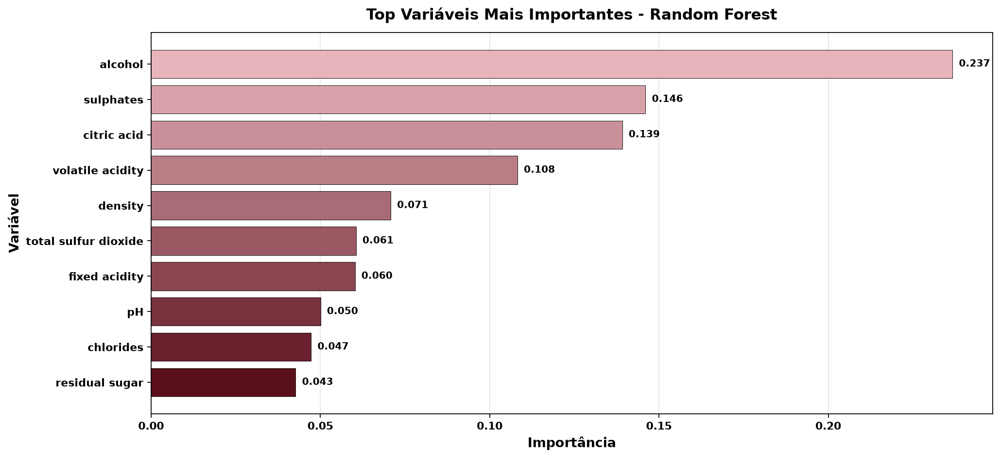
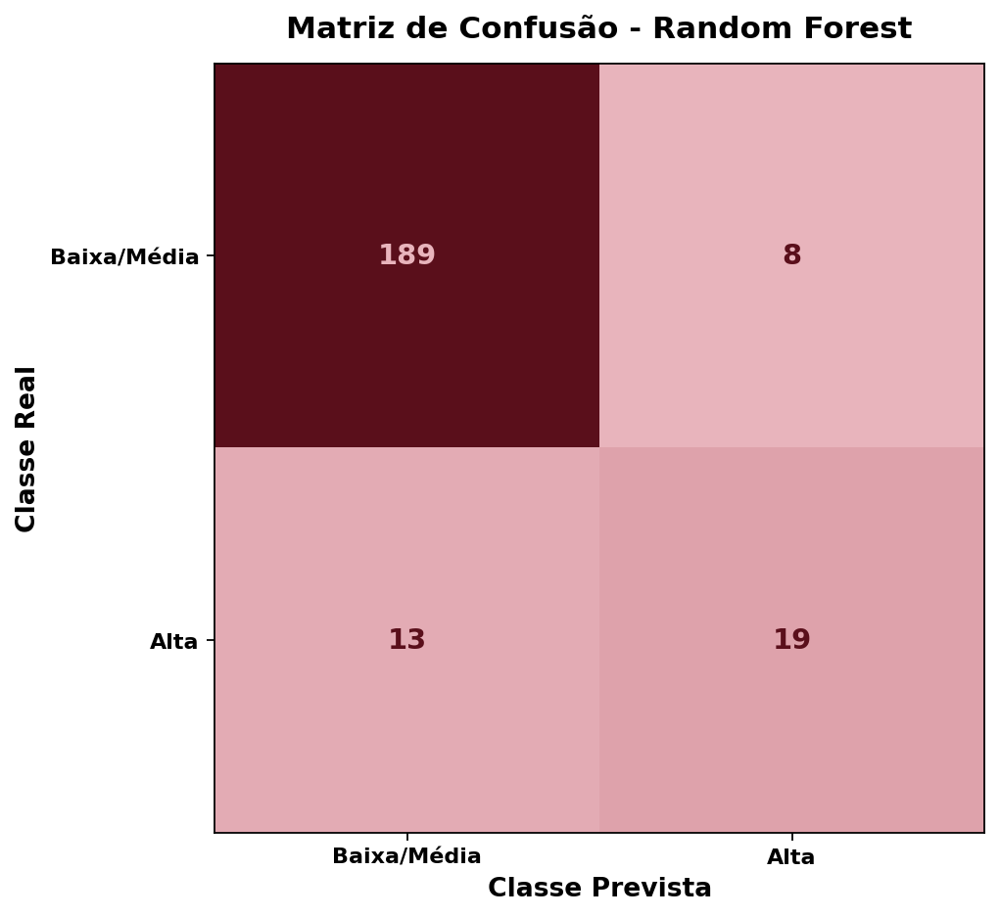

# Tech Challenge Fase 02 — Classificação da Qualidade de Vinhos com Machine Learning

A avaliação sensorial de vinhos é um processo conduzido por especialistas, este projeto desenvolve um modelo preditivo baseado em características físico-químicas mensuráveis, como teor alcoólico, acidez e concentração de sulfatos, capaz de estimar se um vinho será classificado como **Alta Qualidade** ou **Baixa/Média Qualidade**, oferecendo uma alternativa objetiva e reproduzível à avaliação subjetiva.

---

## Definição do Problema

O dataset WineQT atribui a cada amostra de vinho uma nota de qualidade avaliada por especialistas. Para viabilizar a modelagem como classificação binária, a variável alvo foi redefinida da seguinte forma:

- **Alta Qualidade** → nota ≥ 7
- **Baixa/Média Qualidade** → nota < 7

Essa transformação concentra o problema em identificar o que distingue vinhos excepcionais dos demais, usando exclusivamente dados físico-químicos coletados durante a produção.

---

## Análise Exploratória

Antes de qualquer modelagem, o dataset foi investigado em profundidade para entender a distribuição dos dados e as relações entre variáveis.

**Distribuição e balanceamento:**
O dataset contém 1.143 amostras, das quais 86,09% pertencem à classe Baixa/Média Qualidade e apenas 13,91% (159 amostras) à classe Alta Qualidade. Esse desbalanceamento foi considerado em todo o pipeline, com uso de `class_weight="balanced"` nos modelos sensíveis a proporções de classe.

**Correlações com a qualidade:**
A análise de correlação revelou que `alcohol` (r = +0,48) e `volatile acidity` (r = −0,41) são as variáveis com maior poder de separação linear. Teor alcoólico elevado está associado a fermentações bem conduzidas e vinhos mais encorpados, enquanto alta acidez volátil resulta de contaminação bacteriana ou oxidação, o que penaliza a nota. `sulphates` (r = +0,26) e `citric acid` (r = +0,24) apresentam correlação positiva moderada, contribuindo para estabilidade e frescor. `total sulfur dioxide` (r = −0,18) e `density` (r = −0,18) apresentam correlação negativa fraca — excesso de SO₂ compromete aroma e sabor, e densidade mais baixa reflete indiretamente maior teor alcoólico. `chlorides` (r = −0,12) e `fixed acidity` (r = +0,12) têm impacto fraco, enquanto `free sulfur dioxide` (r = −0,06), `pH` (r = −0,05) e `residual sugar` (r = +0,02) apresentam correlação praticamente nula com a qualidade neste dataset.

**Outliers:**
A detecção pelo método IQR identificou valores extremos nas 11 features analisadas, com `residual sugar` (9,62%, 110 amostras) e `chlorides` (6,74%, 77 amostras) como as mais afetadas. Esses valores foram mantidos no dataset — tratam-se de medições físico-químicas reais, não erros de registro. Os modelos selecionados, em especial o Random Forest, são inerentemente robustos a valores extremos por sua natureza baseada em divisões por threshold. Remover esses pontos sem critério rigoroso arriscaria eliminar justamente os vinhos mais atípicos e informativos, em um cenário onde a classe positiva já é escassa.

---

## Pré-processamento

O dataset não apresentou valores faltantes nem registros duplicados, não exigindo imputação. As 11 features originais foram mantidas sem criação de novas variáveis. A análise de correlação não evidenciou combinações que gerassem um sinal mais discriminante do que as variáveis brutas, e o volume reduzido de amostras na classe minoritária (159 registros) tornaria features polinomiais ou de interação um risco real de overfitting. O Random Forest, por sua construção baseada em árvores, captura relações não-lineares e interações entre variáveis internamente, dispensando transformações explícitas. Para os modelos lineares, Regressão Logística e SVM, os dados foram normalizados via `StandardScaler` dentro de um `Pipeline` scikit-learn, garantindo que diferenças de escala entre as variáveis não distorçam os coeficientes ou as margens de separação.

---

## Modelagem e Avaliação

Quatro abordagens foram treinadas e comparadas em um conjunto de teste estratificado, incluindo um baseline probabilístico como referência mínima de desempenho:

| Modelo | Accuracy | Precision (Alta) | Recall (Alta) | F1 (Alta) | ROC-AUC |
|---|---|---|---|---|---|
| **Random Forest** 🏆 | **0,9083** | **0,7037** | **0,5938** | **0,6441** | **0,9113** |
| SVM | 0,8166 | 0,4107 | 0,7188 | 0,5227 | 0,8696 |
| Regressão Logística | 0,7991 | 0,3793 | 0,6875 | 0,4889 | 0,8504 |
| Baseline (classe majoritária) | 0,8603 | 0,0000 | 0,0000 | 0,0000 | 0,5000 |

A métrica de referência para seleção do melhor modelo foi o **F1-Score da classe Alta Qualidade**, por equilibrar precision e recall em um cenário desbalanceado onde errar a classe positiva tem custo maior. O **Random Forest** obteve o melhor desempenho em F1 (0,644) e ROC-AUC (0,911), confirmado pela validação cruzada estratificada com 5 folds (F1 médio: 0,636 ± 0,096), demonstrando capacidade de generalização consistente além do conjunto de teste fixo.

---

## Interpretação dos Resultados

A análise de importância das variáveis do Random Forest confirma e complementa o que a correlação linear sugeria:

| Variável | Importância | Correlação com quality |
|---|---|---|
| alcohol | 22,5% | +0,48 |
| sulphates | 14,8% | +0,26 |
| citric acid | 14,6% | +0,24 |
| volatile acidity | 11,2% | −0,41 |
| density | 7,1% | −0,18 |
| total sulfur dioxide | 6,3% | −0,18 |
| fixed acidity | 5,7% | +0,12 |
| pH | 5,0% | −0,05 |
| chlorides | 5,0% | −0,12 |
| residual sugar | 4,3% | +0,02 |
| free sulfur dioxide | 3,5% | −0,06 |

Do ponto de vista produtivo, os resultados indicam que **fermentações completas** que maximizam a conversão de açúcar em álcool são o fator mais determinante para a qualidade final. O controle da **acidez volátil** é o principal ponto de risco — reduzi-la exige rigor em higiene, controle de temperatura de fermentação e dosagem adequada de SO₂ para inibir bactérias acéticas. **Sulfatos** em nível adequado (mediana: 0,62 g/dm³ no dataset) atuam como conservante e antioxidante, enquanto o **ácido cítrico** reforça o frescor do vinho. O **dióxido de enxofre total** deve ser usado de forma conservadora — suficiente para preservação, mas sem excesso que comprometa aroma e sabor. O **açúcar residual**, por sua vez, revelou-se irrelevante para a qualidade percebida neste perfil de vinho tinto. O foco produtivo deve estar nos fatores fermentativos e de conservação, não no teor de açúcar final.

---

## Dataset

| Atributo | Valor |
|---|---|
| Arquivo | `data/WineQT.csv` |
| Total de registros | 1.143 |
| Features | 11 características físico-químicas |
| Variável alvo | `quality_class` (0 = Baixa/Média, 1 = Alta) |
| Distribuição | ~86% Baixa/Média · ~14% Alta Qualidade |

**Features utilizadas:** fixed acidity, volatile acidity, citric acid, residual sugar, chlorides, free sulfur dioxide, total sulfur dioxide, density, pH, sulphates, alcohol.

---

## Como Rodar

**Ambiente recomendado: Google Colab**

1. Abra o arquivo `.ipynb` no [Google Colab](https://colab.research.google.com/).
2. Faça upload do arquivo `WineQT.csv` pela lateral esquerda do Colab ou deixe o arquivo na pasta `data/`.
3. Execute as células em sequência.

O notebook localiza o CSV automaticamente nos seguintes caminhos, nesta ordem:

```
/content/WineQT.csv
/content/data/WineQT.csv
data/WineQT.csv
../data/WineQT.csv
```

Caso não encontre o arquivo em nenhum desses caminhos, ele abre a opção de upload manual dentro do próprio Colab.

**Dependências** (já disponíveis no Colab, mas caso precise instalar manualmente):

```bash
pip install pandas numpy matplotlib scikit-learn joblib
```

---

## Resultados Visuais

### Distribuição das Notas de Qualidade


### Balanceamento das Classes


### Matriz de Correlação entre Variáveis


### Comparação dos Modelos — F1 da Classe Alta Qualidade


### Importância das Variáveis (Random Forest)


### Matriz de Confusão — Melhor Modelo (Random Forest)


---

## Tecnologias


